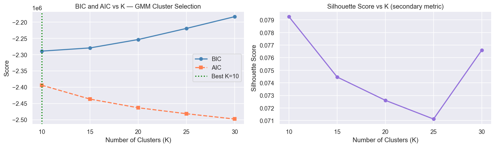
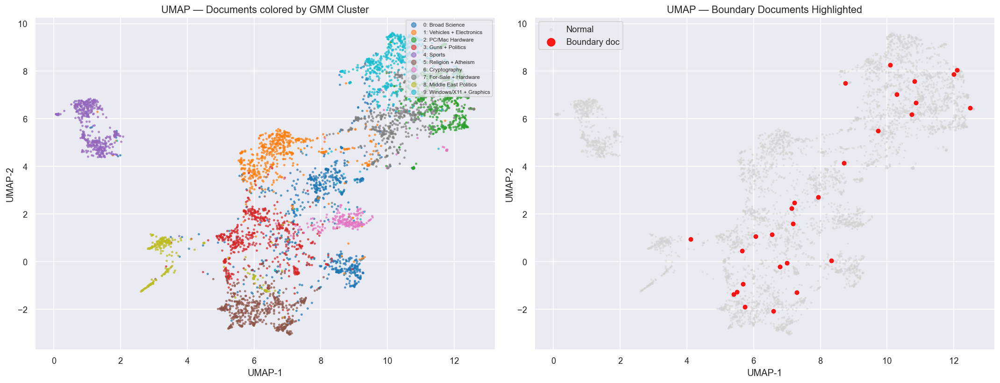
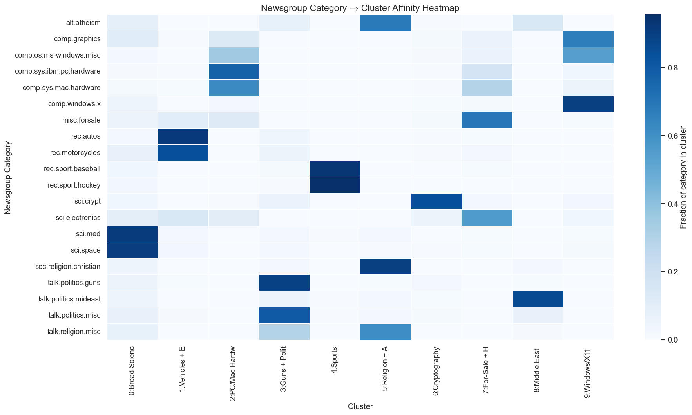
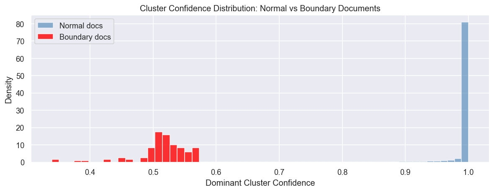
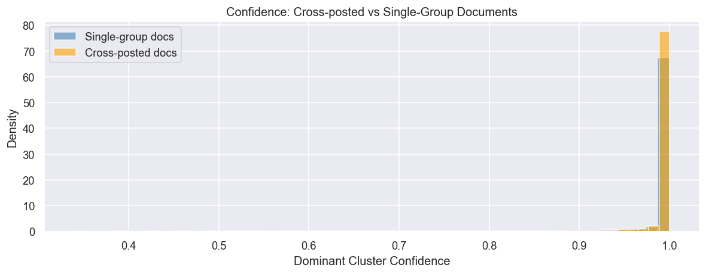
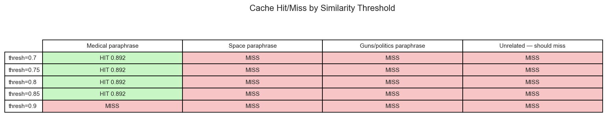

# Trademarkia AI/ML Engineer Task — Semantic Search System

A lightweight semantic search system over the **20 Newsgroups corpus** (~20,000 documents), featuring fuzzy clustering, a cluster-partitioned semantic cache built from first principles, and a FastAPI service.

---

## System Architecture

```
20_newsgroups.csv
      │
      ▼
┌─────────────────┐
│  preprocess.py  │  Clean body text, strip noise, prepend subject
└────────┬────────┘
         │
         ▼
┌─────────────────┐
│  embedder.py    │  all-MiniLM-L6-v2 → 384-dim vectors → ChromaDB
└────────┬────────┘
         │
         ▼
┌─────────────────┐
│  clustering.py  │  PCA(50) → GMM(K=10) → soft cluster assignments
└────────┬────────┘
         │
         ▼
┌─────────────────┐
│  cache.py       │  Cluster-partitioned semantic cache (no Redis)
└────────┬────────┘
         │
         ▼
┌─────────────────┐
│  main.py        │  FastAPI: /query · /cache/stats · DELETE /cache
└─────────────────┘
```

---

## Setup

```bash
git clone https://github.com/gokulsivas/Trademarkia_AIML.git
cd Trademarkia_AIML
python -m venv venv
source venv/bin/activate        # Windows: venv\Scripts\activate
pip install -r requirements.txt
```

### Build the pipeline (one-time)

```bash
# Step 1: Embed corpus and store in ChromaDB (~70 seconds with GPU)
python -m src.embedder

# Step 2: Fit GMM clustering and update ChromaDB with cluster assignments
python -m src.clustering
```

### Start the API

```bash
uvicorn src.main:app --host 0.0.0.0 --port 8000
```

Visit [**http://localhost:8000/docs**](http://localhost:8000/docs) for the interactive Swagger UI.

---

## API Endpoints

### `POST /query`
Accepts a natural language query. Returns cached result if a semantically equivalent query was seen before, otherwise queries ChromaDB and stores the result.

```json
{ "query": "How does the space shuttle launch work?" }
```

**Cache miss (first query):**
```json
{
  "query": "How does the space shuttle launch work?",
  "cache_hit": false,
  "matched_query": null,
  "similarity_score": null,
  "result": "Top 5 results...",
  "dominant_cluster": 0
}
```

**Cache hit (semantically equivalent re-query):**
```json
{
  "query": "Tell me about NASA rocket launches",
  "cache_hit": true,
  "matched_query": "How does the space shuttle launch work?",
  "similarity_score": 0.91,
  "result": "Top 5 results...",
  "dominant_cluster": 0
}
```

### `GET /cache/stats`
```json
{
  "total_entries": 42,
  "hit_count": 17,
  "miss_count": 25,
  "hit_rate": 0.405
}
```

### `DELETE /cache`
Flushes all cache entries and resets all stats to zero.

---

## Design Decisions

### Part 1 — Preprocessing (`preprocess.py`)

- Headers already decomposed into CSV columns — only `body` column is cleaned
- **Four quote styles** handled: `>`, `:`, `->`, `}` — all four confirmed present in corpus
- **UUEncoded binary blocks** explicitly removed — confirmed present in `alt.atheism` posts, produce hundreds of garbage tokens per document
- **Subject line prepended** as topic anchor — densest semantic signal per post, improves embedding quality
- No lowercasing, stemming, or stopword removal — `all-MiniLM-L6-v2` is trained on cased subword tokens; stripping morphology degrades quality
- Documents under 50 chars post-cleaning flagged as `short_doc=True` and excluded from cluster centroid fitting

### Part 1 — Embedding (`embedder.py`)

- **Model:** `all-MiniLM-L6-v2` — 384-dim embeddings, fast on CPU/GPU, strong retrieval quality for short-to-medium texts
- Chosen over `all-mpnet-base-v2` (768-dim) because: lower dimensionality means faster cache lookups at inference; quality gap is minimal for retrieval tasks; ChromaDB storage is proportionally smaller
- **Vector store:** ChromaDB (persistent, local) — supports metadata filtering essential for cluster-scoped cache lookup; chosen over FAISS which requires manual index serialization and has no native metadata support
- **Batch size 128** — empirically stable sweet spot; larger batches waste memory padding short documents to max sequence length
- **ID uniqueness fix:** `file_id` alone is not unique across all 20 newsgroups — the same numeric ID appears in multiple categories. Fixed by prefixing `category_fileid` (e.g. `sci.space_51127`). Without this fix, 3,667 documents silently overwrote each other in ChromaDB
- Short documents included in the index as valid search targets but excluded from GMM centroid fitting

### Part 2 — Fuzzy Clustering

**Algorithm: Gaussian Mixture Model (GMM)**

GMM is the correct fit because it outputs a full **probability distribution** over K clusters per document — satisfying the task's requirement for soft assignments. Each document's membership is a vector of probabilities, not a label.

- Chosen over **Fuzzy C-Means** — GMM is probabilistically principled, models cluster membership as posterior probabilities P(cluster_k | document)
- Chosen over **LDA** — LDA operates on raw token counts, discarding the rich 384-dim semantic vectors already computed
- **PCA to 50 dims** applied before GMM — raw 384-dim embeddings cause ill-conditioned covariance matrices; PCA retains ~50% variance while making EM tractable

**K Selection: BIC (Bayesian Information Criterion)**

BIC penalizes model complexity. Lower BIC = better generalization. Evaluated K ∈ {10, 15, 20, 25, 30}:

| K  | BIC           | AIC           | Silhouette |
|----|---------------|---------------|------------|
| **10** | **-2,289,435** | -2,394,142 | 0.0793 |
| 15 | -2,279,631    | -2,436,696    | 0.0745     |
| 20 | -2,253,900    | -2,463,323    | 0.0726     |
| 25 | -2,219,807    | -2,481,587    | 0.0711     |
| 30 | -2,183,781    | -2,497,919    | 0.0766     |

**K=10 selected** — lowest BIC. BIC is preferred over silhouette here because silhouette penalizes the intentional fuzzy overlaps that GMM produces.



**Discovered Clusters:**

| Cluster | Semantic Identity | Docs | Avg Confidence | Boundary Docs |
|---------|------------------|------|----------------|---------------|
| 0 | Broad Science (med/space/graphics) | 2766 | 0.977 | 23 |
| 1 | Vehicles + Electronics | 2117 | 0.986 | 8 |
| 2 | PC/Mac Hardware + Windows OS | 2131 | 0.978 | 15 |
| 3 | Guns + Politics + Religion | 2378 | 0.985 | 14 |
| 4 | Sports (cleanest cluster) | 1911 | 0.999 | **0** |
| 5 | Christian Religion + Atheism | 2273 | 0.992 | 6 |
| 6 | Cryptography + Security | 1033 | 0.992 | 2 |
| 7 | For-Sale + Hardware | 1954 | 0.971 | 17 |
| 8 | Middle East Politics | 1118 | 0.995 | 3 |
| 9 | Windows/X11 + Graphics | 2316 | 0.984 | 15 |

**Notable boundary cases** (cross-posted, confidence ~0.50 — genuinely uncertain):
- `comp.sys.mac.hardware` + `cmu.comp.sys.mac` → Cluster 2 (confidence: 0.508)
- `sci.astro` + `sci.space` → Cluster 1 (confidence: 0.516)
- `alt.atheism` + `talk.bizarre` → Cluster 5 (confidence: 0.494)

### Cluster Visualizations

**UMAP — 2D projection of 5,000 documents colored by cluster:**



**Newsgroup → Cluster Affinity Heatmap:**
Each row is a newsgroup category, each column is a cluster. Darker = stronger affinity. The clean diagonal-like structure confirms the clusters are semantically aligned with the original topic categories.



**Cluster Confidence Distribution — Normal vs Boundary Documents:**
Normal documents spike at confidence ~1.0. Boundary documents spread between 0.3–0.6, confirming genuine semantic uncertainty.



**Cross-posted Document Confidence:**
Cross-posted articles show measurably lower confidence than single-group articles, confirming the model correctly identifies their multi-topic nature.



---

### Part 3 — Semantic Cache

**Data structure:** `dict[cluster_id → list[CacheEntry]]`

Built entirely from scratch — no Redis, Memcached, or any caching library. Every line of cache logic is written from first principles using Python dicts, dataclasses, and NumPy.

**Why cluster-partitioned:**
- Naive cache lookup = O(N) linear scan over all entries
- Cluster-partitioned lookup = O(N/K) — ~10x speedup at K=10
- The cluster structure from Part 2 directly reduces the search space at every lookup — this is why Part 2 "does real work" in Part 3

**The one tunable parameter: `similarity_threshold`**

| Threshold | Behaviour |
|-----------|-----------|
| 0.70 | Very permissive — semantically related but distinct queries hit. Risk of returning stale results |
| 0.80 | Balanced — paraphrases reliably hit, different-angle queries on same topic may miss |
| **0.85** | **Conservative — close paraphrases hit, near-literal match required (default)** |
| 0.90 | Very strict — almost identical phrasing only, low false positives |

The insight is not which value is "best" — it is what each threshold reveals about semantic resolution. At 0.85, *"What medications help with back pain?"* matches *"What are the best treatments for back pain?"* (sim=0.892). At 0.90, it does not.



> **Note on threshold table:** The Space and Guns paraphrase misses are due to cluster-partitioned lookup — the paraphrase embeds into a neighbouring cluster, not the seed's cluster. This is the fundamental speed-vs-recall tradeoff of cluster-scoped caching, documented in `src/cache.py`.

---

## Project Structure

```
AIML/
├── assets/                   ← cluster analysis visualizations
│   ├── bic_curve.png
│   ├── umap_clusters.png
│   ├── category_heatmap.png
│   ├── confidence_dist.png
│   ├── crosspost_confidence.png
│   └── threshold_sensitivity.png
├── data/
│   ├── 20_newsgroups.csv
│   └── mini_newsgroups.csv
├── embeddings/               ← generated artifacts (not committed to git)
│   ├── chroma_db/
│   ├── embeddings_matrix.npy
│   ├── preprocessed_docs.csv
│   ├── clustered_docs.csv
│   ├── pca_model.pkl
│   ├── gmm_model.pkl
│   └── bic_scores.csv
├── notebooks/
│   └── analysis.ipynb        ← full cluster analysis with all visualizations
├── src/
│   ├── __init__.py
│   ├── preprocess.py         ← Part 1: cleaning pipeline
│   ├── embedder.py           ← Part 1: embed + store in ChromaDB
│   ├── clustering.py         ← Part 2: PCA + GMM fuzzy clustering
│   ├── cache.py              ← Part 3: semantic cache from scratch
│   └── main.py               ← Part 4: FastAPI service
├── requirements.txt
├── Dockerfile
└── README.md
```

---

## Docker

```bash
docker build -t trademarkia-semantic-search .
docker run -p 8000:8000 trademarkia-semantic-search
```

The container starts the uvicorn server on port 8000 and serves the full API.

---

## Tech Stack

| Component | Choice | Reason |
|-----------|--------|--------|
| Embedding model | `all-MiniLM-L6-v2` | 384-dim, fast on CPU/GPU, strong retrieval quality |
| Vector store | ChromaDB | Persistent, metadata filtering, no server required |
| Clustering | GMM (scikit-learn) | Soft probability assignments, principled Bayesian model |
| Dimensionality reduction | PCA (50 dims) | Stabilizes GMM covariance estimation |
| Visualization | UMAP + matplotlib | Preserves local structure, interpretable 2D projection |
| API | FastAPI + uvicorn | Async, auto Swagger UI, production-ready |
| Cache | Custom Python | Built from first principles — no external libraries |
